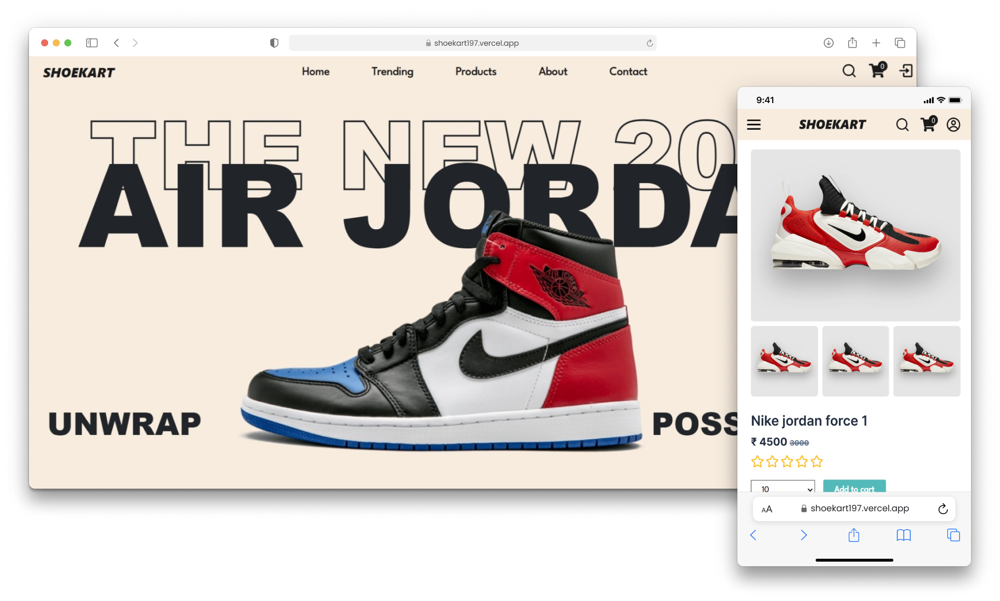

# Shoekart

Welcome to Shoekart – where style meets comfort! Shoekart is an e-commerce platform dedicated to buying shoes, built on the MERN (MongoDB, Express.js, React.js, Node.js) stack. Shoekart not only provides a user-friendly interface for customers to browse and purchase shoes but also includes an admin section for managing products, orders, and users. Additionally, it features a secure payment section powered by Stripe.



## Features

- **Admin Dashboard:** Access a powerful admin dashboard to effortlessly manage products, orders, users, and view insightful statistics.

- **User Authentication and Authorization (JWT):** Securely authenticate users and manage access to resources with JSON Web Tokens (JWT).

- **Responsive Design:** Enjoy a seamless shopping experience across devices with Shoekart's responsive design, ensuring optimal performance on desktops, tablets, and smartphones.

- **Product Listing and Search:** Browse through an extensive catalog of shoe products with the ability to filter by categories, sizes, brands, and more.

- **Cart Management:** Add desired products to your cart, update quantities, and remove items as needed for a seamless shopping experience and apply coupon codes for discounts to enhance your shopping experience.

- **Payment Gateway with Stripe:** Enjoy seamless and secure payment processing through Stripe integration.

- **Order History:** Keep track of your past orders and review order history for easy reference and reordering.

- **Product Details and Reviews:** Access detailed product information and customer reviews to make informed purchasing decisions.

- **Mail Service:** Stay connected with users through email notifications, including order confirmations, shipping updates, and promotional offers.

- **Forgot Password & Reset Password:** Enable users to reset their passwords easily in case they forget, ensuring a smooth user experience.

## Technologies Used

- **React.js**: Frontend library for building the user interface.
- **Node.js**: JavaScript runtime environment for running server-side code.
- **Express.js**: Backend framework for handling HTTP requests and routing.
- **MongoDB**: Database for storing products, user information, and orders.
- **JWT (JSON Web Tokens)**: Used for user authentication and authorization.
- **Axios**: Promise-based HTTP client for making AJAX requests from the frontend to the backend.
- **Stripe**: Payment processing platform for securely accepting payments online.

## Demo

Explore the project: [Shoekart](https://shoekart197.vercel.app)

To experience Shoekart as a demo user, navigate to [User Login](https://shoekart197.vercel.app/login) and use the following credentials:

```plaintext
Username: user@gmail.com
Password: password
```

You can access the admin section by navigating to [Admin Login](https://shoekart197.vercel.app/adminlogin) and using the following credentials:

```plaintext
Username: admin@gmail.com
Password: password
```

## Installation

Follow these steps to set up Shoekart on your local machine:

1.  **Clone the Repository:**

    ```bash
    git clone https://github.com/SumilSuthar197/Shoekart.git
    ```

2.  **Install Dependencies:**

    Navigate to the client directory and install frontend dependencies:

    ```bash
    cd client
    npm install
    ```

    Next, open a new terminal tab, navigate to the server directory and install backend dependencies:

    ```bash
    cd server
    npm install
    ```

3.  **Set up Environment Variables:**

    Create a `.env` file in both the client and server directories and define the following variables in the `.env` file:

    **For Client:**

    ```plaintext
    VITE_REACT_APP_REMOVEBG_KEY=your_removebg_key
    VITE_BACKEND_URL=http://localhost:5000
    ```

    **For Server:**

    ```plaintext
    MONGO_URI=your_mongodb_uri
    JWT_SECRET=your_jwt_secret
    STRIPE_SECRET_KEY=your_stripe_secret_key
    STRIPE_WEBHOOK_SECRET=your_stripe_webhook_secret
    CLIENT_URL=http://localhost:5173
    ```

4.  **Run the Backend Server:**

    Navigate to the server directory and run:

    ```bash
    nodemon app.js
    ```

5.  **Run the Frontend Server:**

    Navigate to the client directory and run:

    ```bash
    npm run dev
    ```

    After running this command, the project will start running locally at http://localhost:5173

## Authors

Made with ❤️ by **[Sumil Suthar](https://sumilsuthar.me/)**
